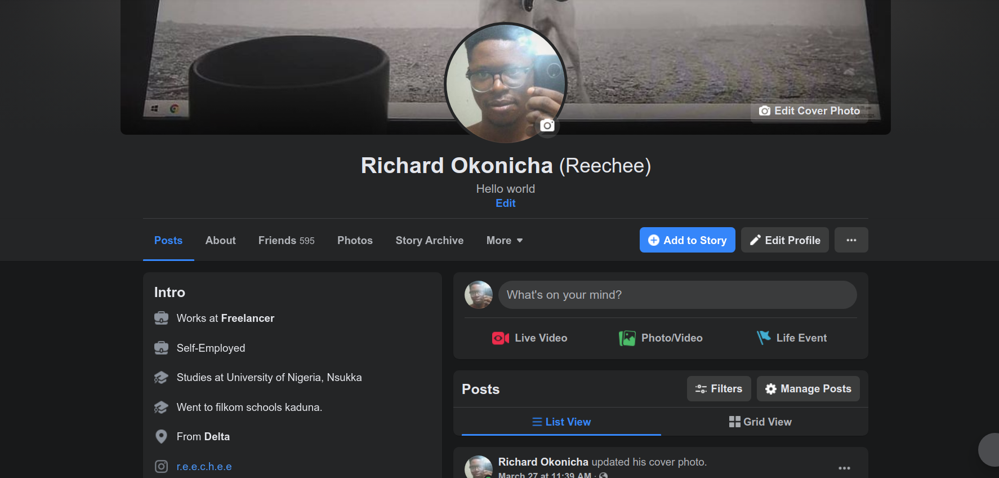

# The Facebook Clone


<!-- PROJECT LOGO -->
<br />
<p align="center">
  <a href="https://github.com/konichar/facebook.clone">
    
  </a>

  <h3 align="center">Facebook helps you connect and share with the people in your life.</h3>

  <p align="center">
   A clone of the facebook profile page built with React and Material UI.
    <br />
    <a href="https://github.com/konichar/facebook.clone"><strong>Explore the site »</strong></a>
    <br />
    <br />
    <a href="https://github.com/konichar/facebook.clone/issues">Report Bug</a>
    ·
    <a href="https://github.com/konichar/facebook.clone/issues">Request Feature</a>
  </p>
</p>


<!-- ABOUT THE PROJECT -->
## About The Project

<!-- [![The Facebook Clone][product-screenshot]](media/readme/desktop.png) -->
<p align=center>
<a href="">
 
</a>
</p>
This web application is written in React & Material-UI  🛫

This project can be used as a boiler plate for more ambitious projects 

### Built With 💖
Major frameworks and services used in the development of this project.
* [React](https://reactjs.org/)  -- A JavaScript library for building user interfaces
* [Material-UI](https://material-ui.com) -- React components for faster and easier web development. Build your own design system, or start with Material Design.

* [Vercel](https://www.heroku.com/) -- Vercel combines the best developer experience with an obsessive focus on end-user performance.
Our platform enables frontend teams to do their best work.
<!-- GETTING STARTED -->
## Getting Started

To get a local copy up and running follow these simple example steps.

* Clone the repository, 
  ```sh
  git clone https://github.com/konichar/facebook.clone.git
  ```

### React Frontend Prerequisites

You need to have the following installed
1. Nodejs
  [https://nodejs.org/](https://nodejs.org/)
  
2. Install application React dependencies
  ```sh
  yarn install
  ```
3. Start frontend server
  ```sh
  yarn start
  ```
  The Frontend server should be `localhost:3000.`

<!-- USAGE EXAMPLES -->
## Usage

This project is preconfigured with create react app for production build and snowpack for development


<!-- ROADMAP -->
## Roadmap

See the [open issues](https://github.com/konichar/facebook.clone/issues) for a list of proposed features (and known issues).

<!-- CONTRIBUTING -->
## Contributing

Contributions are what make the open source community such an amazing place to be learn, inspire, and create. Any contributions you make are **greatly appreciated** 😊

1. Fork the Project
2. Create your Feature Branch (`git checkout -b feature/AmazingFeature`)
3. Commit your Changes (`git commit -m 'Add some AmazingFeature'`)
4. Push to the Branch (`git push origin feature/AmazingFeature`)
5. Open a Pull Request

<!-- LICENSE -->
## License

Distributed under the MIT License. See `LICENSE` for more information.

<!-- CONTACT -->
## Contact
Project Link: [https://github.com/konichar/facebook.clone](https://github.com/konichar/facebook.clone)

Demo Link: [https://github.com/konichar/facebook.clone](https://github.com/konichar/facebook.clone)


<p align=center>
<a href="https://github.com/konichar/facebook.clone">
  
<a/>
If you find this project interesting don't forget to leave a star 💥
</p>


[linkedin-url]: https://linkedin.com/in/richardokonicha
